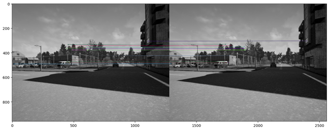

# Visual_Perception_for_Self_driving_Car

# WEEK 1 Results Applying Stereo Depth to a Driving Scenario
 
 
 
Depth Estimation by computing Disparity
Disparity Map

Decompose Projection matrix and generate Depth map

 
Result:

 
Distance to collision

closest_point_depth 29.091

## WEEK 2 Visual Odometry for Localization in Autonomous Driving
In this assignment, you will:
•	Extract features from the photographs taken with a camera setup on the vehicle.
•	Use the extracted features to find matches between the features in different photographs.
•	Use the found matches to estimate the camera motion between subsequent photographs.
•	Use the estimated camera motion to build the vehicle trajectory.
1 - Feature Extraction

2 - Feature Matching

 
3. Movement Visualization

 
Camera location in point 1 is: 
 [[Location X][Location y][Location Z]]= [[ 0.28437721] [-0.1307709 ][ 0.94975185]]

## Final Assignment

Welcome to the final assignment in this course. In this assignment, you will learn how to use the material so far to extract useful scene information to allow self-driving cars to traverse their environment safely and reliably.
In this assignment, you will:
•	Use the output of semantic segmentation neural networks to implement drivable space estimation in 3D.
•	Use the output of semantic segmentation neural networks to implement lane estimation.
•	Use the output of semantic segmentation to filter errors in the output of 2D object detectors.
•	Use the filtered 2D object detection results to determine how far obstacles are from the self-driving car.
Launch the Jupyter Notebook to begin

 

 

 

 

 
 

# TASK 1 1 - Drivable Space Estimation Using Semantic Segmentation Output
Your first task is to implement drivable space estimation in 3D. You are given the output of a semantic segmentation neural network, the camera calibration matrix K, as well as the depth per pixel.
1.1 - Estimating the x, y, and z coordinates of every pixel in the image:
You will be using the equations learned in module 1 to compute the x, y, and z coordinates of every pixel in the image. As a reminder, the equations to get the required 3D coordinates are:
 
Note: Make sure you are on frame 0 for the rest of this assessment. You will use the rest of the frames for testing after the assessment is done.

    Computes the x, and y coordinates of every pixel in the image using the depth map and the calibration matrix.

    Arguments:
    depth -- tensor of dimension (H, W), contains a depth value (in meters) for every pixel in the image.
    k -- tensor of dimension (3x3), the intrinsic camera matrix

    Returns:
    x -- tensor of dimension (H, W) containing the x coordinates of every pixel in the camera coordinate frame.
    y -- tensor of dimension (H, W) containing the y coordinates of every pixel in the camera coordinate frame.

 
# TASK 1.2 1.2 - Estimating The Ground Plane Using RANSAC:
In the context of self-driving cars, drivable space includes any space that the car is physically capable of traversing in 3D. The task of estimating the drivable space is equivalent to estimating pixels belonging to the ground plane in the scene. For the next exercise, you will use RANSAC to estimate the ground plane in the 3D camera coordinate frame from the x,y, and z coordinates estimated above.
The first step is to process the semantic segmentation output to extract the relevant pixels belonging to the class you want consider as ground. For this assessment, that class is the road class with a mapping index of 7. To extract the x,y,z coordinates of the road, run the following cell:

 
Implement RANSAC for plane estimation. Here are the 6 steps:
1.	Choose a minimum of 3 points from xyz_ground at random.
2.	Compute the ground plane model using the chosen random points, and the provided function compute_plane.
3.	Compute the distance from the ground plane model to every point in xyz_ground, and compute the number of inliers based on a distance threshold.
4.	Check if the current number of inliers is greater than all previous iterations and keep the inlier set with the largest number of points.
5.	Repeat until number of iterations ≥≥ a preset number of iterations, or number of inliers ≥≥ minimum number of inliers.
6.	Recompute and return a plane model using all inliers in the final inlier set.
Useful functions: np.random.choice(), compute_plane(), dist_to_plane().

 
 

 
The above visualization only shows where the self-driving car can physically travel. The obstacles such as the SUV to the left of the image, can be seen as dark pixels in our visualization:

 The self-driving car still needs to perform lane estimation to know where it is legally allowed to drive. Once you are comfortable with the estimated drivable space, continue the assessment to estimate the lane where the car can drive.

# Task 2 - Lane Estimation Using The Semantic Segmentation Output
Your second task for this assessment is to use the output of semantic segmentation to estimate the lane boundaries of the current lane the self-driving car is using. This task can be separated to two subtasks, lane line estimation, and post-processing through horizontal line filtering and similar line merging.
2.1 Estimating Lane Boundary Proposals:
The first step to perform this task is to estimate any line that qualifies as a lane boundary using the output from semantic segmentation. We call these lines 'proposals'.
Exercise: Estimate lane line proposals using OpenCv functions. Here are the 3 steps:
1.	Create an image containing the semantic segmentation pixels belonging to categories relevant to the lane boundaries, similar to what we have done previously for the road plane. For this assessment, these pixels have the value of 6 and 8 in the neural network segmentation output.  
 

2.	Perform edge detection on the derived lane boundary image.
3.	Perform line estimation on the output of edge detection.
Useful functions: cv2.Canny(), cv2.HoughLinesP(), np.squeeze().

# TASK 2.2 - Merging and Filtering Lane Lines:
The second subtask to perform the estimation of the current lane boundary is to merge redundant lines, and filter out any horizontal lines apparent in the image. Merging redundant lines can be solved through grouping lines with similar slope and intercept. Horizontal lines can be filtered out through slope thresholding.
Exercise: Post-process the output of the function estimate_lane_lines to merge similar lines, and filter out horizontal lines using the slope and the intercept. The three steps are:
1.	Get every line's slope and intercept using the function provided.
2.	Determine lines with slope less than horizontal slope threshold. Filtering can be performed later if needed.
3.	Cluster lines based on slope and intercept as you learned in Module 6 of the course.
4.	Merge all lines in clusters using mean averaging.

 

# Task 3 - Computing Minimum Distance To Impact Using The Output of 2D Object Detection.
Your final task for this assessment is to use 2D object detection output to determine the minimum distance to impact with objects in the scene. However, the task is complicated by the fact that the provided 2D detections are from a high recall, low precision 2D object detector. You will first be using the semantic segmentation output to determine which bounding boxes are valid. Then, you will compute the minimum distance to impact using the remaining bounding boxes and the depth image. Let us begin with a visualization of the output detection for our current frame. For visualization, you use the provided dataset handler function vis_object_detection as follows:

 

Detections have the format [category, x_min, y_min, x_max, y_max, score]. The Category is a string signifying the classification of the bounding box such as 'Car', 'Pedestrian' or 'Cyclist'. [x_min,y_min] are the coordinates of the top left corner, and [x_max,y_max] are the coordinates of the bottom right corners of the objects. The score signifies the output of the softmax from the neural network.

 

# Task 3.1 - Filtering Out Unreliable Detections:
The first thing you can notice is that an wrong detection occures on the right side of the image. What is interestingis that this wrong detection has a high output score of 0.76 for being a car. Furthermore, two bounding boxes are assigned to the vehicle to the left of the image, both with a very high score, greater than 0.9. This behaviour is expected from a high precision, low recall object detector. To solve this problem, the output of the semantic segmentation network has to be used to eliminate unreliable detections.
Exercise: Eliminate unreliable detections using the output of semantic segmentation. The three steps are:
1.	For each detection, compute how many pixels in the bounding box belong to the category predicted by the neural network.
2.	Devide the computed number of pixels by the area of the bounding box (total number of pixels).
3.	If the ratio is greater than a threshold keep the detection. Else, remove the detection from the list of detections.
 

# Task 3.2 - Estimating Minimum Distance To Impact:
The final task for this assessment is to estimate the minimum distance to every bounding box in the input detections. This can be performed by simply taking the minimum distance from the pixels in the bounding box to the camera center.
Exercise: Compute the minimum distance to impact between every object remaining after filtering and the self-driving car. The two steps are:
1.	Compute the distance to the camera center using the x,y,z arrays from part I. This can be done according to the equation: distance= (x2^2+y2^2+z2^2) ^0.5.
2.	Find the value of the minimum distance of all pixels inside the bounding box.
Output: Minimum distance to impact is: [8.511952208248577]

Expected Output
Minimum distance to impact is: 8.51

Finally:

 

# Validation:
Image
 
# Part 1
 
# Part 2
 
# Part 3
 
The output of semantic segmentation can be used to estimate drivable space. - Classical computer vision can be used to find lane boundaries. - The output of semantic segmentation can be used to filter out unreliable output from object detection.

## License
License
Copyright (C) 2020 Chinmay Rathod.

This program is free software: you can redistribute it and/or modify it under the terms of the GNU General Public License as published by the Free Software Foundation, either version 3 of the License, or (at your option) any later version.

This program is distributed in the hope that it will be useful, but WITHOUT ANY WARRANTY; without even the implied warranty of MERCHANTABILITY or FITNESS FOR A PARTICULAR PURPOSE. See the GNU General Public License for more details.

You should have received a copy of the GNU General Public License along with this program. If not, see http://www.gnu.org/licenses/
License
Copyright (C) 2020 Shaurya Panthri.

This program is free software: you can redistribute it and/or modify it under the terms of the GNU General Public License as published by the Free Software Foundation, either version 3 of the License, or (at your option) any later version.

This program is distributed in the hope that it will be useful, but WITHOUT ANY WARRANTY; without even the implied warranty of MERCHANTABILITY or FITNESS FOR A PARTICULAR PURPOSE. See the GNU General Public License for more details.

You should have received a copy of the GNU General Public License along with this program. If not, see http://www.gnu.org/licenses/
